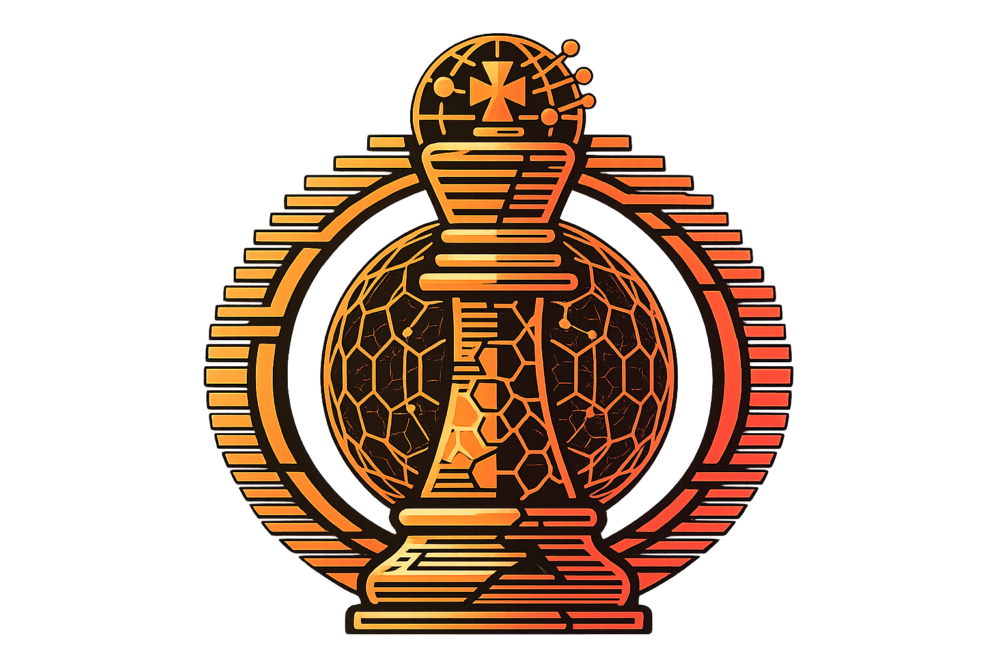

<p align="center">
  
</p>

<h1 align="center">Unicity Chess</h1>

<p align="center">
  Peer-to-peer chess with UCT wagers, running inside <a href="https://sphere.unicity.network/">Unicity Sphere</a>.
</p>

<p align="center">
  <a href="https://mastap.github.io/unicity-sphere-chess/">Play now</a>
</p>

## Overview

Unicity Chess is a real-time chess game that runs as an iframe agent inside Unicity Sphere. Players challenge opponents via DM, wager 10 UCT each, and the winner takes 20 UCT. Draws and aborts refund both players.

## Features

- **P2P via DMs** — challenges, moves, and game events are exchanged through Sphere's Nostr-based direct messages
- **UCT wagers** — 10 UCT entry fee per player, paid out automatically on game end
- **Time controls** — 3, 5, or 10 minute games
- **Deep link challenges** — `unicity-connect://` URLs sent in DMs let opponents accept with one click
- **Sphere integration** — connects via Sphere SDK (`ConnectClient`), blends with Sphere's design system
- **Standalone mode** — also works as a standalone page outside the iframe

## How It Works

1. Player A connects to Sphere and creates a challenge, depositing 10 UCT
2. A challenge link is sent to the opponent via DM
3. Player B opens the link in Sphere, deposits 10 UCT, and the game begins
4. Moves are exchanged as DM messages using the `uc1:` protocol
5. On game end (checkmate, resign, timeout, draw, abort), the winner receives 20 UCT; draws refund 10 UCT each

## Development

### Requirements

- Node.js 20+

### Setup

```bash
npm install
npm run dev       # http://localhost:5173/unicity-sphere-chess/
```

### Build

```bash
npm run build     # TypeScript compile + Vite production build
npm run preview   # Preview production build locally
```

## Protocol

Game messages use the `uc1:<gameId>:<action>` format over Sphere DMs:

| Action | Format | Description |
|--------|--------|-------------|
| Challenge | `unicity-connect://` URL with query params | Sent as a clickable deep link |
| Accept | `uc1:<id>:ac` | Accept challenge |
| Decline | `uc1:<id>:de` | Decline challenge |
| Move | `uc1:<id>:mv:<san>:<clockMs>` | Chess move in SAN notation |
| Resign | `uc1:<id>:re` | Resign the game |
| Draw offer | `uc1:<id>:do` | Offer a draw |
| Draw accept | `uc1:<id>:da` | Accept draw |
| Draw decline | `uc1:<id>:dd` | Decline draw |
| Heartbeat | `uc1:<id>:hb:<clockMs>` | Clock sync |
| Abort | `uc1:<id>:ab` | Abort game |
| Game over | `uc1:<id>:go:<w\|b\|d>:<reason>` | Terminal state |

## Tech Stack

- React 19, TypeScript, Vite
- Tailwind CSS 4
- [chess.js](https://github.com/jhlywa/chess.js) + [react-chessboard](https://github.com/Clariity/react-chessboard)
- [@unicitylabs/sphere-sdk](https://www.npmjs.com/package/@unicitylabs/sphere-sdk) — wallet connection, DMs, intents

## Deployment

Deployed to GitHub Pages via GitHub Actions on push to `main`:

https://mastap.github.io/unicity-sphere-chess/

## License

MIT
