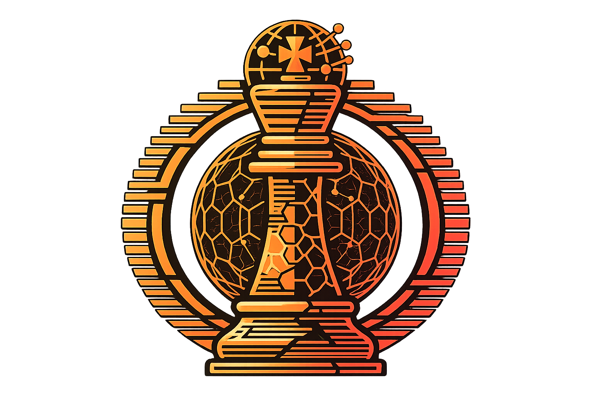

<p align="center">
  
</p>

<h1 align="center">Unicity Chess</h1>

<p align="center">
  Peer-to-peer chess with UCT wagers, running inside <a href="https://sphere.unicity.network/">Unicity Sphere</a>.
</p>

<p align="center">
  <a href="https://mastap.github.io/unicity-sphere-chess/">Play now</a>
</p>

## Overview

Unicity Chess is a real-time chess game that runs as an iframe agent inside Unicity Sphere. Players challenge opponents via DM, wager 10 UCT each, and the winner takes 20 UCT. Draws and aborts refund both players.

## Features

- **P2P via DMs** — challenges, moves, and game events are exchanged through Sphere's Nostr-based direct messages
- **UCT wagers** — 10 UCT entry fee per player, paid out automatically on game end
- **Game NFTs** — every finished game of at least 5 moves is minted as an NFT into each human player's own wallet: an image of the final position from that player's side, with the full PGN and the result as attributes
- **Time controls** — 3, 5, or 10 minute games
- **Deep link challenges** — `unicity-connect://` URLs sent in DMs let opponents accept with one click
- **Sphere integration** — connects via Sphere SDK (`ConnectClient`), blends with Sphere's design system
- **Standalone mode** — also works as a standalone page outside the iframe

## How It Works

1. Player A connects to Sphere and creates a challenge, depositing 10 UCT
2. A challenge link is sent to the opponent via DM
3. Player B opens the link in Sphere, deposits 10 UCT, and the game begins
4. Moves are exchanged as DM messages using the `uc1:` protocol
5. On game end (checkmate, resign, timeout, draw, abort), the winner receives 20 UCT; draws refund 10 UCT each
6. Once that prompt is answered, each player's wallet asks to mint the game's NFT (not for aborted games or games under 5 moves)

## Game NFTs

Each client asks its own wallet to mint the NFT with the `mint_nft` Connect intent (Sphere Connect 2.3, `nft:mint` scope). The wallet mints into its own address, signs as the creator, and always asks the player to confirm, so nobody can mint into someone else's wallet. In a game against a bot only the human's client runs this app, so only the human gets one.

| Field | Content |
|-------|---------|
| Name | `@white vs @black · 1-0` |
| Description | Who won, how, and in how many moves |
| Image | PNG of the final position from the minting player's side, last move highlighted |
| Attributes | White, Black, Result, Termination, Moves, Time control, Date, Bot ELO (bot games), Game ID, Final position (FEN), PGN |
| Collection | `Unicity Chess` |

A wallet that approved Unicity Chess before `nft:mint` was requested keeps its earlier permissions; the player disconnects and connects again to allow minting. A wallet older than Connect 2.3 can still play, and is told it can't mint NFTs yet.

## Development

### Requirements

- Node.js 20+

### Setup

```bash
npm install
npm run dev       # http://localhost:5173/unicity-sphere-chess/
npm test          # unit tests (vitest)
```

### Build

```bash
npm run build     # TypeScript compile + Vite production build
npm run preview   # Preview production build locally
```

## Protocol

Game messages use the `uc1:<gameId>:<action>` format over Sphere DMs:

| Action | Format | Description |
|--------|--------|-------------|
| Challenge | `unicity-connect://` URL with query params | Sent as a clickable deep link |
| Accept | `uc1:<id>:ac` | Accept challenge |
| Decline | `uc1:<id>:de` | Decline challenge |
| Move | `uc1:<id>:mv:<san>:<clockMs>` | Chess move in SAN notation |
| Resign | `uc1:<id>:re` | Resign the game |
| Draw offer | `uc1:<id>:do` | Offer a draw |
| Draw accept | `uc1:<id>:da` | Accept draw |
| Draw decline | `uc1:<id>:dd` | Decline draw |
| Heartbeat | `uc1:<id>:hb:<clockMs>` | Clock sync |
| Abort | `uc1:<id>:ab` | Abort game |
| Game over | `uc1:<id>:go:<w\|b\|d>:<reason>` | Terminal state |

## Tech Stack

- React 19, TypeScript, Vite
- Tailwind CSS 4
- [chess.js](https://github.com/jhlywa/chess.js) + [react-chessboard](https://github.com/Clariity/react-chessboard)
- [@unicitylabs/sphere-sdk](https://www.npmjs.com/package/@unicitylabs/sphere-sdk) — wallet connection, DMs, intents

## Deployment

Deployed to GitHub Pages via GitHub Actions on push to `main`:

https://mastap.github.io/unicity-sphere-chess/

## License

MIT
